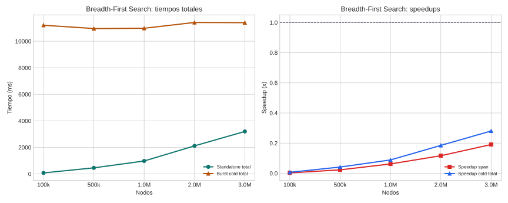

# Breadth-First Search

## Teoría

BFS recorre un grafo por niveles a partir de un nodo fuente y produce la distancia en aristas desde esa fuente al resto de nodos alcanzables.

## Implementaciones comparadas

- **Standalone**: binario Rust monohilo que carga el grafo completo y expande una frontera FIFO nivel a nivel.
- **Burst**: acción distribuida en OpenWhisk que reparte el grafo por particiones y sincroniza la frontera global entre workers.

## Dataset y metodología

- Dataset base: grafo dirigido sintético.
- Puntos probados: 100k, 500k, 1.0M, 2.0M, 3.0M.
- Detalle: Se reutilizó exactamente el mismo grafo por tamaño, subiendo a MinIO las particiones que consume burst y usando la copia local para standalone.
- Marco de lectura: siguiendo COST, la comparación principal se hace sobre tiempo end-to-end real; siguiendo el artículo de burst computing, se separa ese coste del span algorítmico para entender cuánto aporta el paralelismo útil.
- Métricas reportadas: cold end-to-end, span algorítmico, y warm end-to-end solo cuando el benchmark lo publique explícitamente.
- En esta campaña no hay una columna warm separada; no se ha imputado artificialmente a partir de otras marcas temporales.
- Configuración de campaña: partitions=4, max_levels=500, memory_mb=4096, source_node=0, density=10.
- Validación: Para tamaños grandes se reutilizó el mismo dataset en todas las repeticiones; la comparación funcional fuerte se apoya en la revisión estática y en las campañas pequeñas previas, porque el chequeo completo del vector de niveles no se ejecutó en memoria a estos tamaños.

## Resultados

| Nodos | SA total (ms) | Burst cold (ms) | Burst warm (ms) | SA exec (ms) | Burst span (ms) | Speedup cold | Speedup warm | Speedup span |
| --- | ---: | ---: | ---: | ---: | ---: | ---: | ---: | ---: |
| 100k | 76.40 | 11204.20 | n/d | 9.40 | 3303.40 | 0.01x | n/d | 0.00x |
| 500k | 456.60 | 10952.80 | n/d | 77.80 | 3378.60 | 0.04x | n/d | 0.02x |
| 1.0M | 973.80 | 10977.00 | n/d | 201.80 | 3249.60 | 0.09x | n/d | 0.06x |
| 2.0M | 2112.60 | 11412.80 | n/d | 397.60 | 3407.40 | 0.19x | n/d | 0.12x |
| 3.0M | 3199.60 | 11397.80 | n/d | 722.00 | 3784.80 | 0.28x | n/d | 0.19x |

## Lectura de Métricas

- `Cold end-to-end`: mide la latencia real observada si la campaña dispara workers fríos.
- `Warm end-to-end`: modela workers precalentados; solo se reporta cuando el benchmark la publica explícitamente.
- `Span algorítmico`: aísla el tramo de cómputo distribuido y sirve para explicar la escalabilidad del algoritmo, no para sustituir al tiempo real del sistema.

## Hallazgos

- En el punto menor (100k), standalone total tarda 76.4 ms y burst cold total 11204.2 ms.
- En el punto mayor (3.0M), standalone total tarda 3199.6 ms y burst cold total 11397.8 ms.
- Standalone sigue por delante en todo el rango probado según tiempo total cold; el cruce queda por encima del máximo medido.
- La campaña actual no publica todavía una métrica warm end-to-end separada; solo pueden compararse explícitamente cold total y span.
- Standalone sigue por delante en todo el rango probado según span algorítmico; el cruce queda por encima del máximo medido.
