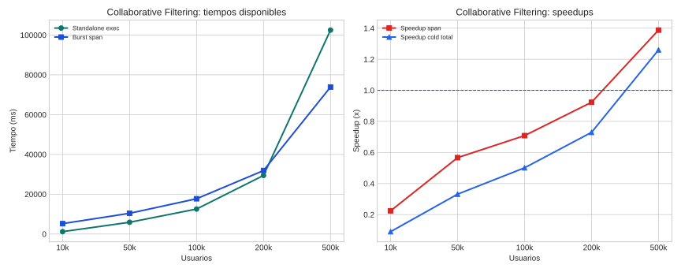

# Collaborative Filtering

## Teoría

Collaborative Filtering con ALS factoriza la matriz usuario-item en vectores latentes alternando pasos de optimización para usuarios e ítems.

## Implementaciones comparadas

- **Standalone**: binario Rust local que entrena ALS sobre el dataset completo.
- **Burst**: versión burst que reparte ratings entre workers y coordina las actualizaciones de factores latentes.

## Dataset y metodología

- Dataset base: datasets sintéticos de ratings.
- Puntos probados: 10k, 50k, 100k, 200k, 500k.
- Detalle: Cada punto usa un dataset sintético fijo por tamaño, reutilizado entre repeticiones y replicado a MinIO para burst.
- Marco de lectura: siguiendo COST, la comparación principal se hace sobre tiempo end-to-end real; siguiendo el artículo de burst computing, se separa ese coste del span algorítmico para entender cuánto aporta el paralelismo útil.
- Limitación: este informe no dispone todavía de una métrica cold total comparable para todo el rango, así que las conclusiones quedan apoyadas sobre todo en span algorítmico.
- En esta campaña no hay una columna warm separada; no se ha imputado artificialmente a partir de otras marcas temporales.
- Configuración de campaña: partitions=4, num_factors=10, iterations=15, reg_lambda=0.1, memory_mb=4096.
- Validación: La validación compara RMSE y parámetros estructurados de la ejecución burst frente al standalone.

## Resultados

| Usuarios | SA total (ms) | Burst cold (ms) | Burst warm (ms) | SA exec (ms) | Burst span (ms) | Speedup cold | Speedup warm | Speedup span |
| --- | ---: | ---: | ---: | ---: | ---: | ---: | ---: | ---: |
| 10k | n/d | 12962.00 | n/d | 1167.40 | 5206.20 | 0.09x | n/d | 0.22x |
| 50k | n/d | 17776.00 | n/d | 5890.80 | 10396.20 | 0.33x | n/d | 0.57x |
| 100k | n/d | 25025.60 | n/d | 12542.20 | 17705.00 | 0.50x | n/d | 0.71x |
| 200k | n/d | 40349.00 | n/d | 29431.00 | 31883.00 | 0.73x | n/d | 0.92x |
| 500k | n/d | 81339.00 | n/d | 102492.00 | 73858.00 | 1.26x | n/d | 1.39x |

## Lectura de Métricas

- `Cold end-to-end`: mide la latencia real observada si la campaña dispara workers fríos.
- `Warm end-to-end`: modela workers precalentados; solo se reporta cuando el benchmark la publica explícitamente.
- `Span algorítmico`: aísla el tramo de cómputo distribuido y sirve para explicar la escalabilidad del algoritmo, no para sustituir al tiempo real del sistema.

## Hallazgos

- En el punto menor (10k), standalone exec tarda 1167.4 ms y burst span 5206.2 ms.
- En el punto mayor (500k), standalone exec tarda 102492.0 ms y burst span 73858.0 ms.
- La campaña actual no publica todavía una métrica warm end-to-end separada; solo pueden compararse explícitamente cold total y span.
- Cruce estimado dentro del rango probado según span algorítmico: aproximadamente 249,656 usuarios.
- Intervalos con cambio de ganador observados según tiempo total extremo a extremo cold: 200k a 500k.
