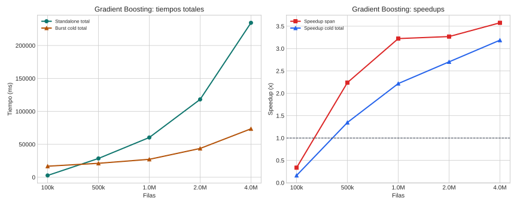

# Gradient Boosting

## Teoría

Gradient Boosting construye un ensamble aditivo de árboles donde cada árbol intenta corregir el residuo del ensamble acumulado.

## Implementaciones comparadas

- **Standalone**: binario Rust monohilo que entrena el ensamble completo localmente.
- **Burst**: acción distribuida que reparte filas entre workers y agrega histogramas parciales para construir los árboles.

## Dataset y metodología

- Dataset base: subconjuntos crecientes de HIGGS.
- Puntos probados: 100k, 500k, 1.0M, 2.0M, 4.0M.
- Detalle: Cada tamaño reutiliza exactamente el mismo subconjunto de HIGGS en local y sus particiones equivalentes en MinIO.
- Marco de lectura: siguiendo COST, la comparación principal se hace sobre tiempo end-to-end real; siguiendo el artículo de burst computing, se separa ese coste del span algorítmico para entender cuánto aporta el paralelismo útil.
- Métricas reportadas: cold end-to-end, span algorítmico, y warm end-to-end solo cuando el benchmark lo publique explícitamente.
- En esta campaña no hay una columna warm separada; no se ha imputado artificialmente a partir de otras marcas temporales.
- Configuración de campaña: partitions=4, num_trees=100, max_depth=6, learning_rate=0.1, memory_mb=4096.
- Validación: Cada repetición valida accuracy y logloss contra la salida burst estructurada en S3.

## Resultados

| Filas | SA total (ms) | Burst cold (ms) | Burst warm (ms) | SA exec (ms) | Burst span (ms) | Speedup cold | Speedup warm | Speedup span |
| --- | ---: | ---: | ---: | ---: | ---: | ---: | ---: | ---: |
| 100k | 2737.20 | 16788.40 | n/d | 2735.40 | 8137.40 | 0.16x | n/d | 0.34x |
| 500k | 28538.60 | 21172.60 | n/d | 28532.00 | 12739.40 | 1.35x | n/d | 2.24x |
| 1.0M | 60349.60 | 27211.40 | n/d | 60336.00 | 18718.80 | 2.22x | n/d | 3.22x |
| 2.0M | 118178.40 | 43710.00 | n/d | 118153.60 | 36147.80 | 2.70x | n/d | 3.27x |
| 4.0M | 234453.80 | 73550.40 | n/d | 234413.60 | 65546.20 | 3.19x | n/d | 3.58x |

## Lectura de Métricas

- `Cold end-to-end`: mide la latencia real observada si la campaña dispara workers fríos.
- `Warm end-to-end`: modela workers precalentados; solo se reporta cuando el benchmark la publica explícitamente.
- `Span algorítmico`: aísla el tramo de cómputo distribuido y sirve para explicar la escalabilidad del algoritmo, no para sustituir al tiempo real del sistema.

## Hallazgos

- En el punto menor (100k), standalone total tarda 2737.2 ms y burst cold total 16788.4 ms.
- En el punto mayor (4.0M), standalone total tarda 234453.8 ms y burst cold total 73550.4 ms.
- Cruce estimado dentro del rango probado según tiempo total cold: aproximadamente 382,555 filas.
- La campaña actual no publica todavía una métrica warm end-to-end separada; solo pueden compararse explícitamente cold total y span.
- Cruce estimado dentro del rango probado según span algorítmico: aproximadamente 239,490 filas.
- Intervalos con cambio de ganador observados según tiempo total extremo a extremo cold: 100k a 500k.
