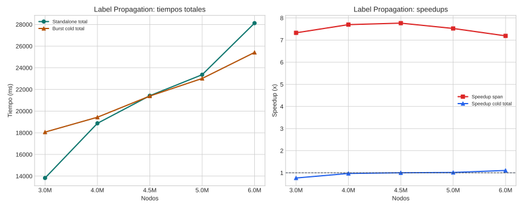

# Label Propagation

## Teoría

Label Propagation difunde etiquetas por vecindad hasta estabilizarse y suele usarse para clasificación semisupervisada o detección de comunidades ligeras.

## Implementaciones comparadas

- **Standalone**: implementación Rust monohilo con acceso completo al grafo y a las etiquetas.
- **Burst**: acción distribuida que reparte el grafo por particiones y agrega los votos de etiquetas entre workers.

## Dataset y metodología

- Dataset base: grafo sintético con propagación de etiquetas.
- Puntos probados: 3.0M, 4.0M, 4.5M, 5.0M, 6.0M.
- Detalle: La campaña seria reutilizó el mismo dataset por tamaño y la misma semilla en standalone y burst.
- Marco de lectura: siguiendo COST, la comparación principal se hace sobre tiempo end-to-end real; siguiendo el artículo de burst computing, se separa ese coste del span algorítmico para entender cuánto aporta el paralelismo útil.
- Métricas reportadas: cold end-to-end, span algorítmico, y warm end-to-end solo cuando el benchmark lo publique explícitamente.
- En esta campaña no hay una columna warm separada; no se ha imputado artificialmente a partir de otras marcas temporales.
- Configuración de campaña: partitions=4, max_iter=10, memory_mb=4096, density=20, python_cmd=/home/sergio/src/bfs/.venv/bin/python.
- Validación: Las rondas de la campaña reutilizan el mismo dataset y la equivalencia semántica se corrigió antes de lanzar esta tanda.

## Resultados

| Nodos | SA total (ms) | Burst cold (ms) | Burst warm (ms) | SA exec (ms) | Burst span (ms) | Speedup cold | Speedup warm | Speedup span |
| --- | ---: | ---: | ---: | ---: | ---: | ---: | ---: | ---: |
| 3.0M | 13825.00 | 18063.40 | n/d | 9153.80 | 1248.80 | 0.77x | n/d | 7.33x |
| 4.0M | 18873.40 | 19436.00 | n/d | 12742.20 | 1655.00 | 0.97x | n/d | 7.70x |
| 4.5M | 21420.40 | 21391.80 | n/d | 14511.00 | 1868.20 | 1.00x | n/d | 7.77x |
| 5.0M | 23361.60 | 23015.20 | n/d | 15602.60 | 2073.20 | 1.02x | n/d | 7.53x |
| 6.0M | 28122.60 | 25418.00 | n/d | 18890.60 | 2626.40 | 1.11x | n/d | 7.19x |

## Lectura de Métricas

- `Cold end-to-end`: mide la latencia real observada si la campaña dispara workers fríos.
- `Warm end-to-end`: modela workers precalentados; solo se reporta cuando el benchmark la publica explícitamente.
- `Span algorítmico`: aísla el tramo de cómputo distribuido y sirve para explicar la escalabilidad del algoritmo, no para sustituir al tiempo real del sistema.

## Hallazgos

- En el punto menor (3.0M), standalone total tarda 13825.0 ms y burst cold total 18063.4 ms.
- En el punto mayor (6.0M), standalone total tarda 28122.6 ms y burst cold total 25418.0 ms.
- Cruce estimado dentro del rango probado según tiempo total cold: aproximadamente 4,478,477 nodos.
- La campaña actual no publica todavía una métrica warm end-to-end separada; solo pueden compararse explícitamente cold total y span.
- Burst ya supera a standalone en todo el rango probado según span algorítmico; el cruce queda por debajo del mínimo medido.
- Aquí se ve bien la diferencia entre sistema y algoritmo: burst gana en span, pero el cold end-to-end todavía no amortiza el arranque y la coordinación.
- Intervalos con cambio de ganador observados según tiempo total extremo a extremo cold: 4.0M a 4.5M.
