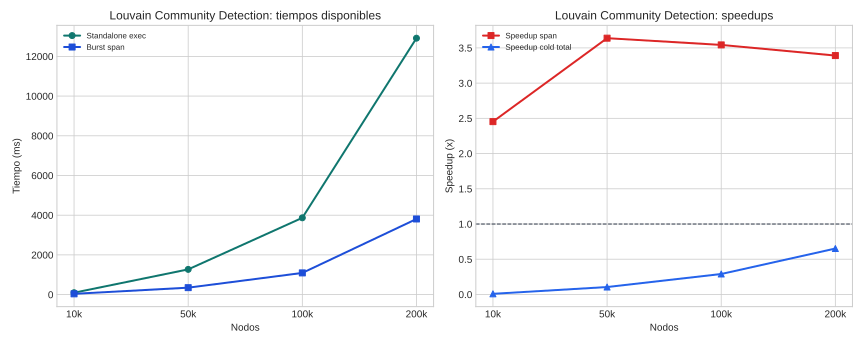

# Louvain Community Detection

## Teoría

Louvain maximiza modularidad moviendo nodos entre comunidades y, en su formulación habitual, reagrupa la solución para refinarla jerárquicamente.

## Implementaciones comparadas

- **Standalone**: binario Rust que optimiza modularidad sobre el grafo completo.
- **Burst**: versión distribuida que reparte el grafo y sincroniza cambios de comunidad y métricas globales entre workers.

## Dataset y metodología

- Dataset base: grafo planted-partition ponderado.
- Puntos probados: 10k, 50k, 100k, 200k.
- Detalle: Se usaron grafos planted-partition con semillas fijas y el mismo dataset por tamaño para ambas implementaciones.
- Marco de lectura: siguiendo COST, la comparación principal se hace sobre tiempo end-to-end real; siguiendo el artículo de burst computing, se separa ese coste del span algorítmico para entender cuánto aporta el paralelismo útil.
- Limitación: este informe no dispone todavía de una métrica cold total comparable para todo el rango, así que las conclusiones quedan apoyadas sobre todo en span algorítmico.
- En esta campaña no hay una columna warm separada; no se ha imputado artificialmente a partir de otras marcas temporales.
- Configuración de campaña: partitions=4, max_passes=20, min_gain=1e-06, p_in=0.05, p_out=0.001, memory_mb=2048, comparison_mode=full.
- Validación: Las campañas cerradas hasta 200k validaron estrictamente la partición; además, una corrida manual posterior validó 300k y mostró el techo operativo burst antes de 400k.

## Resultados

| Nodos | SA total (ms) | Burst cold (ms) | Burst warm (ms) | SA exec (ms) | Burst span (ms) | Speedup cold | Speedup warm | Speedup span |
| --- | ---: | ---: | ---: | ---: | ---: | ---: | ---: | ---: |
| 10k | n/d | 10826.20 | n/d | 95.20 | 38.80 | 0.01x | n/d | 2.45x |
| 50k | n/d | 12057.00 | n/d | 1270.40 | 349.20 | 0.11x | n/d | 3.64x |
| 100k | n/d | 13325.60 | n/d | 3868.20 | 1092.00 | 0.29x | n/d | 3.54x |
| 200k | n/d | 19816.80 | n/d | 12917.00 | 3809.00 | 0.65x | n/d | 3.39x |

## Lectura de Métricas

- `Cold end-to-end`: mide la latencia real observada si la campaña dispara workers fríos.
- `Warm end-to-end`: modela workers precalentados; solo se reporta cuando el benchmark la publica explícitamente.
- `Span algorítmico`: aísla el tramo de cómputo distribuido y sirve para explicar la escalabilidad del algoritmo, no para sustituir al tiempo real del sistema.

## Hallazgos

- En el punto menor (10k), standalone exec tarda 95.2 ms y burst span 38.8 ms.
- En el punto mayor (200k), standalone exec tarda 12917.0 ms y burst span 3809.0 ms.
- La campaña actual no publica todavía una métrica warm end-to-end separada; solo pueden compararse explícitamente cold total y span.
- Burst ya supera a standalone en todo el rango probado según span algorítmico; el cruce queda por debajo del mínimo medido.
- En campañas posteriores, 300k nodos validó correctamente y 400k/500k fallaron en runtime burst, así que el techo operativo quedó entre 300k y 400k.
