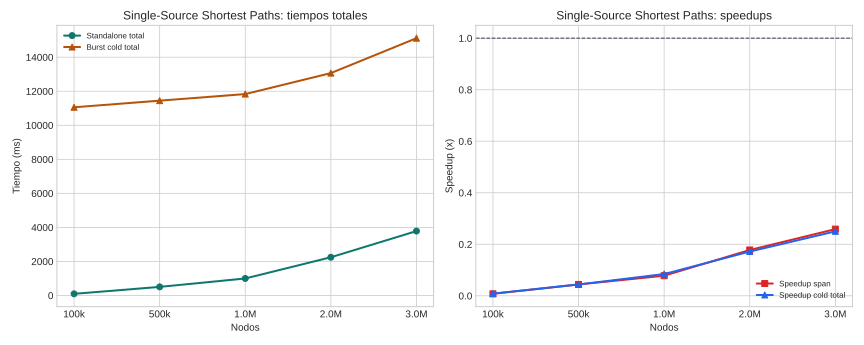

# Single-Source Shortest Paths

## Teoría

SSSP calcula las distancias mínimas desde una fuente al resto de nodos. En este workspace se trabaja con pesos no negativos y la versión burst propaga relajaciones entre particiones.

## Implementaciones comparadas

- **Standalone**: binario Rust local que ejecuta el algoritmo de caminos mínimos sobre el grafo completo.
- **Burst**: versión distribuida que reparte aristas por partición y coordina mejoras de distancia a través del middleware burst.

## Dataset y metodología

- Dataset base: grafo ponderado sintético con pesos no negativos.
- Puntos probados: 100k, 500k, 1.0M, 2.0M, 3.0M.
- Detalle: Los grafos se generaron una vez por tamaño con la misma semilla y los mismos pesos para ambas implementaciones.
- Marco de lectura: siguiendo COST, la comparación principal se hace sobre tiempo end-to-end real; siguiendo el artículo de burst computing, se separa ese coste del span algorítmico para entender cuánto aporta el paralelismo útil.
- Métricas reportadas: cold end-to-end, span algorítmico, y warm end-to-end solo cuando el benchmark lo publique explícitamente.
- En esta campaña no hay una columna warm separada; no se ha imputado artificialmente a partir de otras marcas temporales.
- Configuración de campaña: partitions=4, max_iterations=500, memory_mb=4096, source_node=0, density=10, max_weight=10.0.
- Validación: Las repeticiones reutilizan el mismo dataset; el benchmark grande omite la validación in-memory completa por coste, pero sí compara métricas de salida consistentes y se ejecutó sobre exactamente la misma entrada.

## Resultados

| Nodos | SA total (ms) | Burst cold (ms) | Burst warm (ms) | SA exec (ms) | Burst span (ms) | Speedup cold | Speedup warm | Speedup span |
| --- | ---: | ---: | ---: | ---: | ---: | ---: | ---: | ---: |
| 100k | 96.60 | 11058.00 | n/d | 26.00 | 3355.80 | 0.01x | n/d | 0.01x |
| 500k | 504.60 | 11447.40 | n/d | 153.80 | 3490.40 | 0.04x | n/d | 0.04x |
| 1.0M | 999.60 | 11833.40 | n/d | 323.40 | 4141.00 | 0.08x | n/d | 0.08x |
| 2.0M | 2246.20 | 13066.60 | n/d | 807.20 | 4536.40 | 0.17x | n/d | 0.18x |
| 3.0M | 3784.00 | 15117.40 | n/d | 1633.00 | 6306.60 | 0.25x | n/d | 0.26x |

## Lectura de Métricas

- `Cold end-to-end`: mide la latencia real observada si la campaña dispara workers fríos.
- `Warm end-to-end`: modela workers precalentados; solo se reporta cuando el benchmark la publica explícitamente.
- `Span algorítmico`: aísla el tramo de cómputo distribuido y sirve para explicar la escalabilidad del algoritmo, no para sustituir al tiempo real del sistema.

## Hallazgos

- En el punto menor (100k), standalone total tarda 96.6 ms y burst cold total 11058.0 ms.
- En el punto mayor (3.0M), standalone total tarda 3784.0 ms y burst cold total 15117.4 ms.
- Standalone sigue por delante en todo el rango probado según tiempo total cold; el cruce queda por encima del máximo medido.
- La campaña actual no publica todavía una métrica warm end-to-end separada; solo pueden compararse explícitamente cold total y span.
- Standalone sigue por delante en todo el rango probado según span algorítmico; el cruce queda por encima del máximo medido.
- La campaña confirmó que el fallo previo estaba en el preflight S3 y no en el algoritmo burst.
