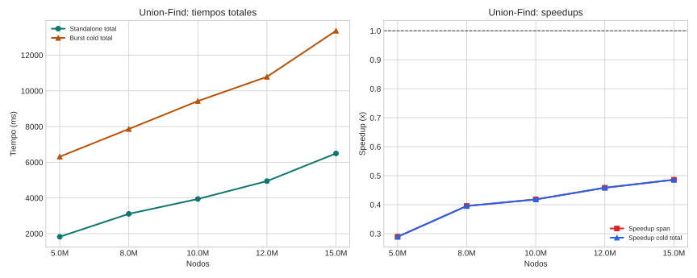

# Union-Find

## Teoría

Union-Find mantiene componentes conexas mediante operaciones de unión y búsqueda de representante, normalmente optimizadas con union by rank y path compression.

## Implementaciones comparadas

- **Standalone**: binario Rust local que procesa el grafo completo y devuelve la partición final.
- **Burst**: acción distribuida que ejecuta uniones locales por partición y luego coordina la fusión global entre workers.

## Dataset y metodología

- Dataset base: grafo sintético por componentes disjuntas.
- Puntos probados: 5.0M, 8.0M, 10.0M, 12.0M, 15.0M.
- Detalle: Los grafos sintéticos se generan una vez por tamaño con el mismo número de componentes y aristas por nodo para ambas implementaciones.
- Marco de lectura: siguiendo COST, la comparación principal se hace sobre tiempo end-to-end real; siguiendo el artículo de burst computing, se separa ese coste del span algorítmico para entender cuánto aporta el paralelismo útil.
- Métricas reportadas: cold end-to-end, span algorítmico, y warm end-to-end solo cuando el benchmark lo publique explícitamente.
- En esta campaña no hay una columna warm separada; no se ha imputado artificialmente a partir de otras marcas temporales.
- Configuración de campaña: partitions=4, memory_mb=2048, edges_per_node=5, components=10.
- Validación: La validación fuerte usa hash canónico de la partición además del número de componentes. El benchmark ya quedó preparado para separar tiempo total y span, pero la campaña agregada actual todavía debe reejecutarse si se quiere una lectura estrictamente alineada con cold starts.

## Resultados

| Nodos | SA total (ms) | Burst cold (ms) | Burst warm (ms) | SA exec (ms) | Burst span (ms) | Speedup cold | Speedup warm | Speedup span |
| --- | ---: | ---: | ---: | ---: | ---: | ---: | ---: | ---: |
| 5.0M | 1826.60 | 6313.80 | n/d | 1826.60 | 6313.80 | 0.29x | n/d | 0.29x |
| 8.0M | 3109.60 | 7862.80 | n/d | 3109.60 | 7862.80 | 0.40x | n/d | 0.40x |
| 10.0M | 3942.60 | 9427.80 | n/d | 3942.60 | 9427.80 | 0.42x | n/d | 0.42x |
| 12.0M | 4943.40 | 10785.00 | n/d | 4943.40 | 10785.00 | 0.46x | n/d | 0.46x |
| 15.0M | 6494.80 | 13364.60 | n/d | 6494.80 | 13364.60 | 0.49x | n/d | 0.49x |

## Lectura de Métricas

- `Cold end-to-end`: mide la latencia real observada si la campaña dispara workers fríos.
- `Warm end-to-end`: modela workers precalentados; solo se reporta cuando el benchmark la publica explícitamente.
- `Span algorítmico`: aísla el tramo de cómputo distribuido y sirve para explicar la escalabilidad del algoritmo, no para sustituir al tiempo real del sistema.

## Hallazgos

- En el punto menor (5.0M), standalone total tarda 1826.6 ms y burst cold total 6313.8 ms.
- En el punto mayor (15.0M), standalone total tarda 6494.8 ms y burst cold total 13364.6 ms.
- Standalone sigue por delante en todo el rango probado según tiempo total cold; el cruce queda por encima del máximo medido.
- La campaña actual no publica todavía una métrica warm end-to-end separada; solo pueden compararse explícitamente cold total y span.
- Standalone sigue por delante en todo el rango probado según span algorítmico; el cruce queda por encima del máximo medido.
