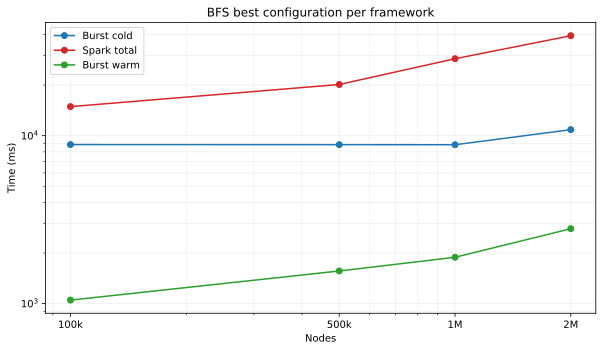
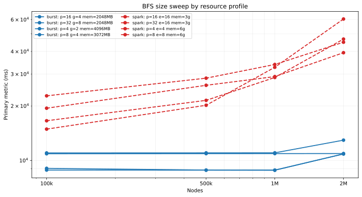
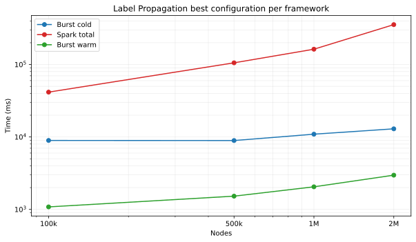
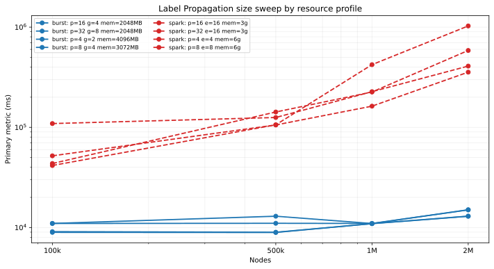
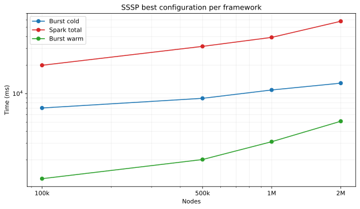
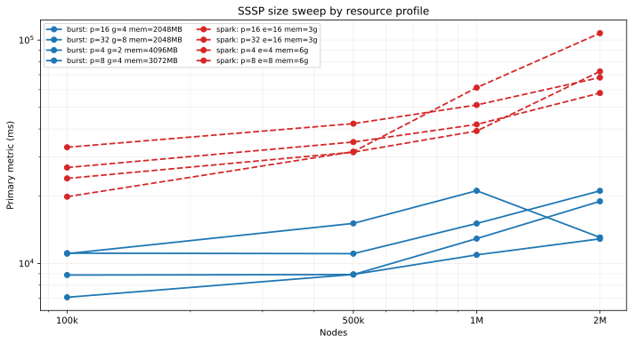
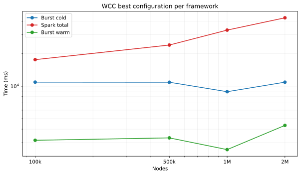
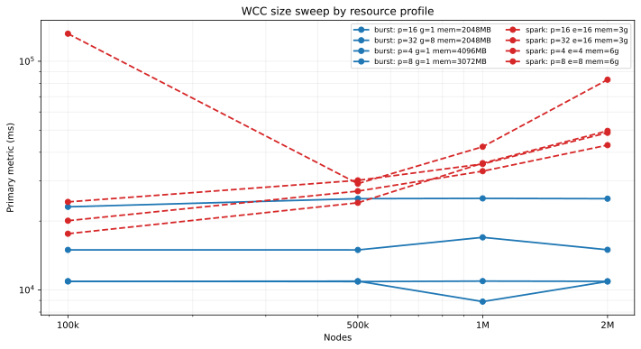

# Resource Sweep Summary

## Overview

- Burst size-sweep rows: `64` passed.
- Spark size-sweep rows: `64` passed.
- Comparison uses the best passed configuration per framework at each input size.

## BFS

| Nodes | Best Burst cold (ms) | Best Burst warm (ms) | Best Spark total (ms) | Burst profile | Spark profile | Faster cold |
| --- | ---: | ---: | ---: | --- | --- | --- |
| 100k | 8849.00 | 1049.00 | 14896.00 | p=8 g=4 mem=3072MB | p=4 e=4 mem=6g | burst |
| 500k | 8839.00 | 1564.00 | 20176.67 | p=8 g=4 mem=3072MB | p=4 e=4 mem=6g | burst |
| 1M | 8828.00 | 1887.00 | 28734.67 | p=4 g=2 mem=4096MB | p=8 e=8 mem=6g | burst |
| 2M | 10860.00 | 2792.00 | 39382.00 | p=8 g=4 mem=3072MB | p=16 e=16 mem=3g | burst |

## Label Propagation

| Nodes | Best Burst cold (ms) | Best Burst warm (ms) | Best Spark total (ms) | Burst profile | Spark profile | Faster cold |
| --- | ---: | ---: | ---: | --- | --- | --- |
| 100k | 8956.00 | 1084.00 | 41606.33 | p=8 g=4 mem=3072MB | p=4 e=4 mem=6g | burst |
| 500k | 8930.00 | 1525.00 | 105609.33 | p=8 g=4 mem=3072MB | p=16 e=16 mem=3g | burst |
| 1M | 10930.00 | 2052.00 | 162753.33 | p=4 g=2 mem=4096MB | p=16 e=16 mem=3g | burst |
| 2M | 12960.00 | 2971.00 | 355506.33 | p=4 g=2 mem=4096MB | p=16 e=16 mem=3g | burst |

## SSSP

| Nodes | Best Burst cold (ms) | Best Burst warm (ms) | Best Spark total (ms) | Burst profile | Spark profile | Faster cold |
| --- | ---: | ---: | ---: | --- | --- | --- |
| 100k | 7058.00 | 1268.00 | 19904.33 | p=4 g=2 mem=4096MB | p=4 e=4 mem=6g | burst |
| 500k | 8922.00 | 2019.00 | 31498.00 | p=8 g=4 mem=3072MB | p=8 e=8 mem=6g | burst |
| 1M | 10928.00 | 3111.00 | 39181.67 | p=4 g=2 mem=4096MB | p=8 e=8 mem=6g | burst |
| 2M | 12893.00 | 5113.00 | 57941.00 | p=4 g=2 mem=4096MB | p=16 e=16 mem=3g | burst |

## WCC

| Nodes | Best Burst cold (ms) | Best Burst warm (ms) | Best Spark total (ms) | Burst profile | Spark profile | Faster cold |
| --- | ---: | ---: | ---: | --- | --- | --- |
| 100k | 10901.00 | 3156.00 | 17611.00 | p=4 g=1 mem=4096MB | p=8 e=8 mem=6g | burst |
| 500k | 10877.00 | 3321.00 | 24047.00 | p=32 g=8 mem=2048MB | p=8 e=8 mem=6g | burst |
| 1M | 8889.00 | 2586.00 | 33065.00 | p=4 g=1 mem=4096MB | p=16 e=16 mem=3g | burst |
| 2M | 10892.00 | 4336.00 | 42978.33 | p=4 g=1 mem=4096MB | p=16 e=16 mem=3g | burst |
